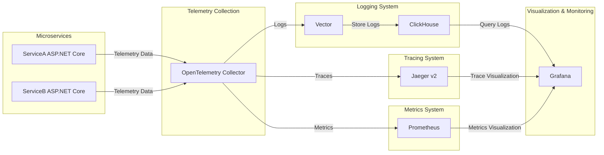

# Monitoring System Architecture

## Overview
This repository contains a monitoring system setup for .NET microservices using **OpenTelemetry, Jaeger, Prometheus, Vector, ClickHouse, and Grafana**.

## Architecture Diagram


## Components

### Microservices
- **ServiceA & ServiceB**: .NET Core applications sending telemetry data.

### Telemetry Collection
- **OpenTelemetry Collector**: Collects logs, traces, and metrics, then forwards them.

### Logging System
- **Vector**: Aggregates logs and sends them to ClickHouse.
- **ClickHouse**: Stores structured logs efficiently.

### Tracing System
- **Jaeger v2**: Stores traces for distributed request tracking.

### Metrics System
- **Prometheus**: Collects and stores metrics data.

### Visualization & Monitoring
- **Grafana**: Central dashboard for monitoring logs, traces, and metrics.

## Getting Started
### Running the System
Ensure you have Docker installed, then run:
```sh
docker-compose up -d
```

### Accessing Services
- **Grafana**: [http://localhost:3000](http://localhost:3000)
- **Jaeger UI**: [http://localhost:16686](http://localhost:16686)
- **Prometheus**: [http://localhost:9090](http://localhost:9090)

## Contributing
Feel free to submit pull requests or issues for improvements!
